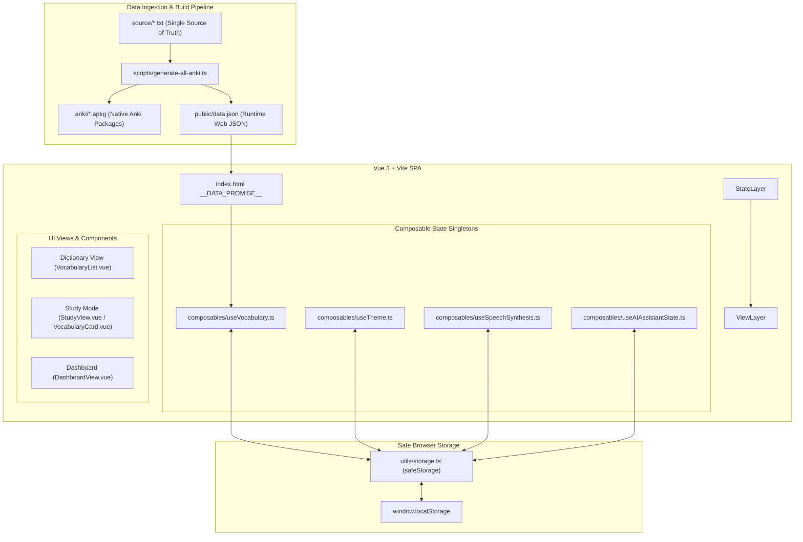
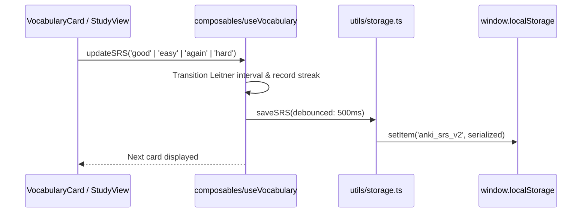
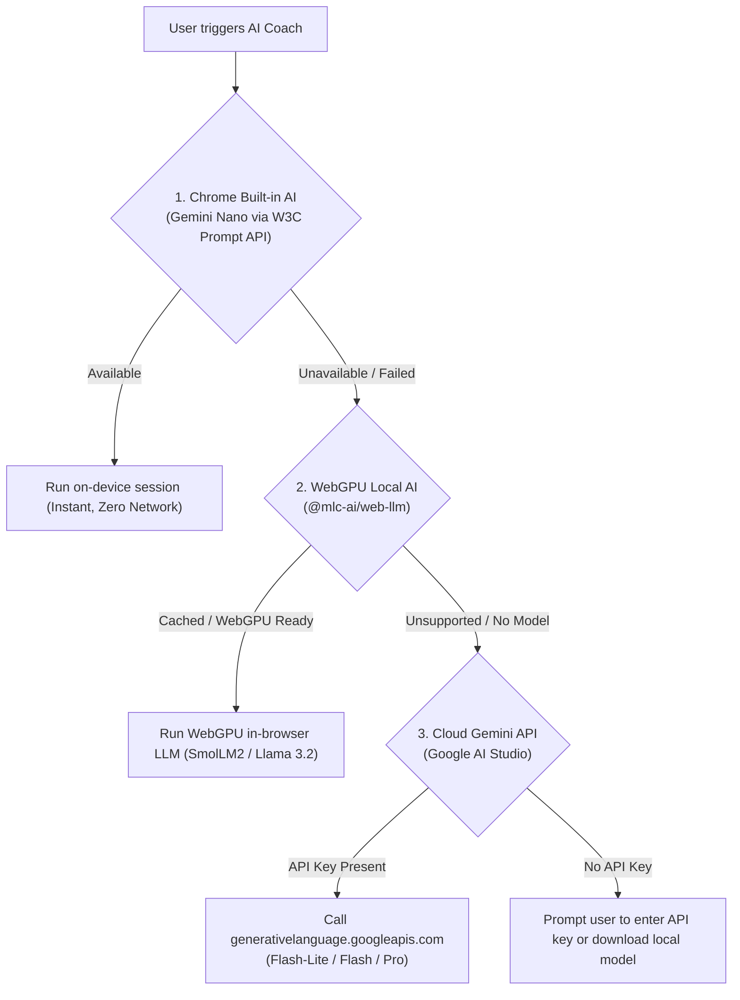

# Architecture & Data Flow

This document provides a comprehensive overview of the `anki-b2` codebase, its subsystems, state management, and data flow pipelines.

> [!NOTE]
> For the historical rationale, trade-offs, and key technical decisions behind this architecture, see the **[Architecture Decision Records (.agents/DECISIONS.md)](file:///home/kubuntu/Dev/anki-b2/.agents/DECISIONS.md)**.

---

## 1. High-Level System Architecture

---

## 2. Vocabulary Data Ingestion Flow

1. **Source of Truth**: `source/*.txt` files format vocabulary lines as:
   `German; English; Ukrainian; Example Sentence`
2. **Build Utilities** (`scripts/utils.ts`):
   - `cleanGermanForAudio`: Prepares natural text for TTS audio playback by removing grammatical placeholders (`etw.`, `jdn.`, parentheticals).
   - `highlightWordInExample`: Automatically detects the lemma or inflected forms inside example sentences and wraps them in `<b style="color: #eab308;">`.
   - `colorizeGenderArticle`: Formats masculine/feminine/neuter articles for Anki card front styling.
3. **Distribution Targets**:
   - `anki/*.apkg`: Anki collection packages containing bi-directional flashcards (Card 1: Recognition, Card 2: Production) under fixed note model ID `1607392319`.
   - `public/data.json`: Static JSON read by the client application at runtime.

---

## 3. Client State Management Architecture

The application adopts the **Vue 3 Composable Singleton Pattern**:
- Stateful reactive properties (e.g. `vocabulary`, `masteredIds`, `srsData`, `studyStreak`) are declared at the **module scope** outside the composable function.
- Every component calling `useVocabulary()` shares the exact same reactive state without needing external state libraries like Pinia.
- Debounced mutations (`saveSRS`) sync state to `localStorage` with safety flushes on `beforeunload` and `visibilitychange: hidden`.

---

## 4. AI Coach Multi-Tier Engine Hierarchy

When the user requests grammar notes or workplace dialogues, the application queries AI backends through a cascading fallback strategy:

### Safety & Resilience in AI Calls:
- **Request Cancellation**: Every user-initiated call binds to an `AbortController`. When switching cards or closing dialogs, previous in-flight requests are automatically aborted.
- **Key Validation**: Keys are verified with `isValidApiKey` (`^[A-Za-z0-9_\-]{6,128}$`) before being passed to HTTP headers.
- **Model URL Encoding**: Candidate model names are encoded via `encodeURIComponent` to prevent injection.
- **Strict Output Sanitization**: AI responses pass through `sanitizeAiHtml` which forbids `style` attributes and isolates Markdown syntax.

---

## 5. Security & Isolation Matrix

| Subsystem | Input Source | Security Controls |
|---|---|---|
| **Vocabulary Cards** | `public/data.json` | `sanitizeHtml`: allows only `<b>`, `<i>`, ``, `<em>`, `
`, ` `. Restricts inline CSS to `color: #eab308;`. |
| **AI Responses** | On-device, WebGPU, Cloud LLM | `sanitizeAiHtml`: disallows `style`, sanitizes script tags, formats lists/code. |
| **Backup Import** | User JSON file upload | File size capped at 5MB, entries capped at 25,000, prototype pollution blocked (`__proto__`, `constructor`), `Number.isFinite` validation. |
| **Speech Audio** | SpeechSynthesis API | `cleanTextForSpeech`: strips HTML tags, clears multiple punctuation and Markdown before TTS. |
| **Browser Execution** | HTML Document | Content Security Policy: `base-uri 'self'`, `object-src 'none'`, `form-action 'self'`, `img-src 'self' data:`. |
