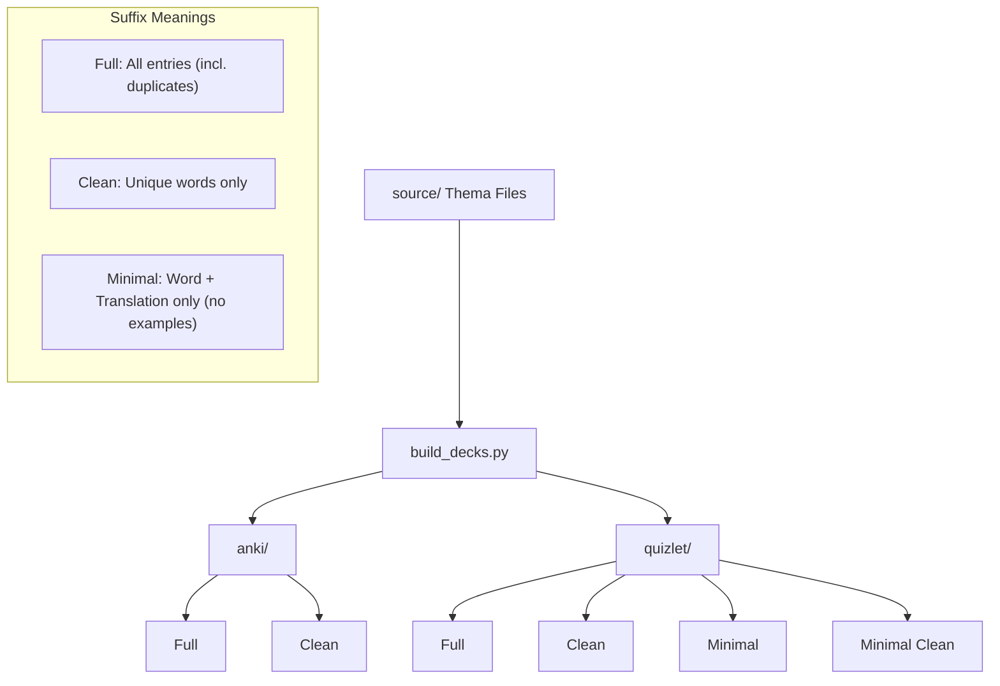

# Anki & Quizlet German Vocabulary (B1+ & B2 Beruf)

This repository contains professional thematic vocabulary files for Anki and Quizlet, covering German B1+ and B2 levels specifically from a **B2 Beruf** course. Each entry includes German terms, English and Ukrainian translations, and German example sentences.

## Project Structure

- `source/`: Original thematic vocabulary files (`B1_plus_Thema*.txt`, `B2_Thema*.txt`).
- `anki/`: Generated import files for Anki decks.
- `quizlet/`: Generated import files for Quizlet sets.
- `tools/`: Automation scripts for maintaining the repository.

## Automation Tools

### 1. `standardize.py`
Ensures all files in `source/` strictly adhere to the expected Anki format.
- **Usage**: `python3 tools/standardize.py`

### 2. `build_decks.py`
Scans the `source/` directory and regenerates all files in `anki/` and `quizlet/`.
- **Usage**: `python3 tools/build_decks.py`

## Deck Versions & Generation

The `build_decks.py` tool generates multiple versions of each deck to suit different learning styles:

### Version Suffixes
- **`_Full.txt`**: Contains every entry from every thematic file. Useful if you want to study words in the context of their specific themes.
- **`_Clean.txt`**: Removes duplicate words across different themes. Best for long-term vocabulary building.
- **`_Minimal.txt`**: Formats entries for Quizlet as `Term <Tab> Definition / Translation` without example sentences.
- **`_Minimal_Clean.txt`**: Combined Minimal format with duplicates removed.

## Audio Pronunciation

To enhance your learning with audio, follow our [AwesomeTTS Guide](file:///home/kubuntu/Dev/anki-b2/AUDIO_GUIDE.md) to automatically add German pronunciation to your Anki decks.

## Import Instructions

### For Anki
1. Use any file from the `anki/` directory.
2. In Anki, select `File` -> `Import`.
3. Headers are embedded, so field mapping is automatic.
4. **Tip**: Add an `Audio` field to your card type if you plan to use AwesomeTTS.

### For Quizlet.com
1. Use any file from the `quizlet/` directory.
2. On Quizlet, click **Create** -> **Study set** -> **Import**.
3. Paste the file content.
4. Set **"Between term and definition"** to **Tab**.
5. Set **"Between cards"** to **New line**.

---
*Developed for B2 Beruf IT German Course.*
