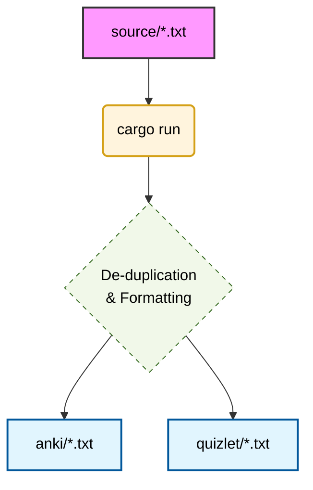

# Anki & Quizlet German Vocabulary (B1+ & B2 Beruf)

This repository contains professional thematic vocabulary files for Anki and Quizlet, covering German B1+ and B2 levels specifically from a **B2 Beruf** course. Each entry includes German terms, English and Ukrainian translations, and German example sentences.

## Project Structure

- `source/`: Original thematic vocabulary files (`B1_plus_Thema*.txt`, `B2_Thema*.txt`).
- `anki/`: Generated import files for Anki decks.
- `quizlet/`: Generated import files for Quizlet sets.
- `Cargo.toml` & `src/`: High-performance Rust application for building decks.

## Automation Tools

### 1. Rust Build Tool (`rs_build`)
Standardizes the `source/` directory and regenerates all files in `anki/`, `quizlet/`, and `docs/`.
- **Usage**: `cargo run --release`

## Deck Versions & Generation

The Rust build tool (`cargo run --release`) generates multiple versions of each deck to suit different learning styles:

### Path to Optimized Learning
The workflow ensures that your **source** data remains the "Single Source of Truth", while the **anki/** and **quizlet/** folders act as distribution targets.

### Version Suffixes
- **`_Full.txt`**: Contains every entry from every thematic file. Useful if you want to study words in the context of their specific themes.
- **`_Clean.txt`**: Removes duplicate words across different themes. Best for long-term vocabulary building.
- **`_Minimal.txt`**: Formats entries for Quizlet as `Term <Tab> Definition / Translation` without example sentences.
| Suffix | Logic | Contents | Best for |
|---|---|---|---|
| **`_Full.txt`** | All source entries | DE; EN; UA; Example | Thematic learning |
| **`_Clean.txt`** | All unique entries | DE; EN; UA; Example | Efficient long-term review |
| **`_Minimal.txt`** | All source entries | DE; EN / UA (No examples) | Quizlet quick review |
| **`_Minimal_Clean.txt`** | Unique entries | DE; EN / UA (No examples) | Clean Quizlet review |

## 🌐 Interactive Vocabulary Website

This project includes a modern, searchable web interface hosted via **GitHub Pages**.

- **Live Search**: Find any word across German, English, and Ukrainian fields.
- **Filtering**: Quickly filter by Level (B1+, B2) or specific Theme.
- **Mobile Ready**: Study on the go with a responsive, premium design.

To view the site, enable GitHub Pages in your repository settings pointing to the `/docs` folder.

## 🛠️ How to use
nciation

To enhance your learning with audio, follow our [AwesomeTTS Guide](file:///home/kubuntu/Dev/anki-b2/AUDIO_GUIDE.md) to automatically add German pronunciation to your Anki decks.

## Import Instructions

### For Anki
1. Use any file from the `anki/` directory.
2. In Anki, select `File` -> `Import`.
3. Headers are embedded, so field mapping is automatic.
4. **Tip**: Add an `Audio` field to your card type if you plan to use AwesomeTTS.

### For Quizlet.com
1. Use any file from the `quizlet/` directory.
2. On Quizlet, click **Create** -> **Study set** -> **Import**.
3. Paste the file content.
4. Set **"Between term and definition"** to **Tab**.
5. Set **"Between cards"** to **New line**.

---
*Developed for B2 Beruf IT German Course.*
