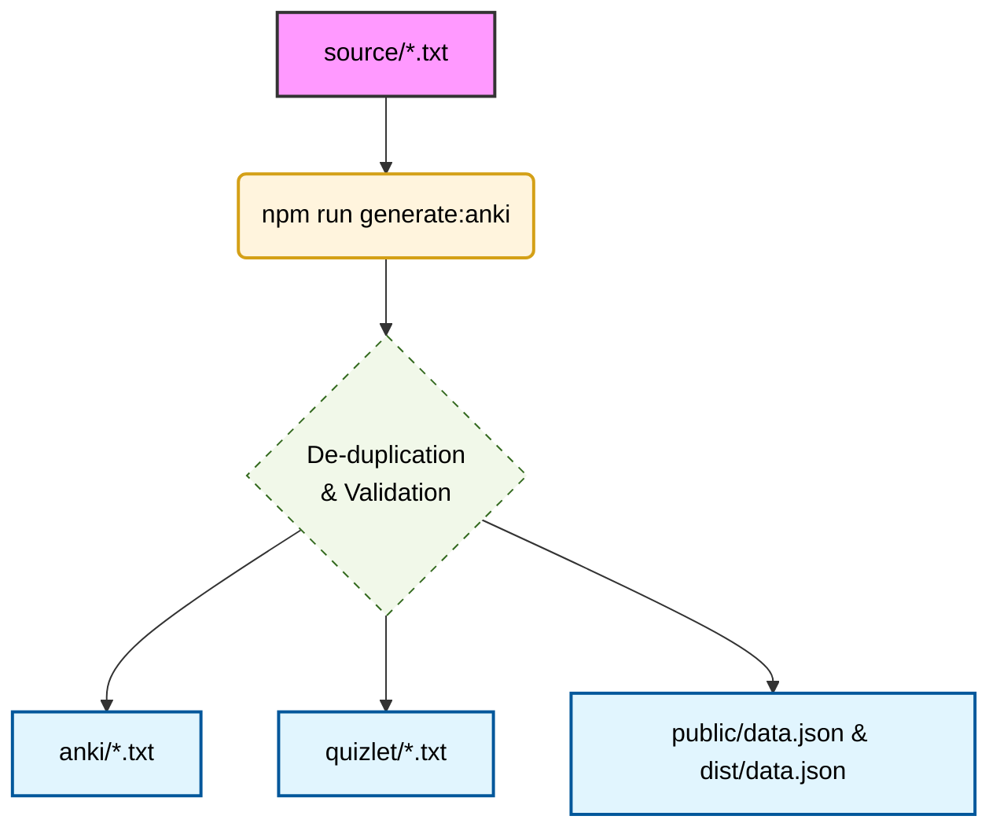

# Anki & Quizlet German Vocabulary (B1+/B2 Beruf)

🌐 **[Live Interactive Vocabulary Web App & Dashboard](https://andreysey.github.io/anki-b2/)**

This repository contains professional thematic German vocabulary decks for Anki, Quizlet, and a modern, interactive PWA web application specifically aligned with the **telc Deutsch-Test für den Beruf B1+ and B2** exams.

---

## ✨ Features & Architecture

### 1. 🎓 Exam-Aligned Content (telc B1+/B2 Beruf)

- **Real-World Corporate Context**: Example sentences tailored to German workplace scenarios (works council `Betriebsrat`, contracts `Arbeitsvertrag`, vocational training `Berufsausbildung`, workplace safety `Arbeitsschutz`, etc.).
- **Grammar Interleaving**: Active focus on _Nomen-Verb-Verbindungen_, _Verben/Adjektive mit Präpositionen_, and professional _Redemittel_.

### 2. 🖥️ Modern macOS Sequoia Design System

- **Frosted Glass Acrylic Aesthetics**: Ultra-clean desktop-inspired window frame, ambient wallpaper mesh, and smooth micro-animations.
- **Light & Dark Themes**: Fully tailored theme palettes with instant toggle and system preference sync.
- **Responsive Layout**: Optimized for mobile phones, tablets, and desktop displays with compact, viewport-friendly spacing.

### 3. 🧠 Spaced Repetition (SRS) & Study Modes

- **Leitner 5-Stage SRS Pipeline**: Grade learning retention (`Again`, `Hard`, `Good`, `Easy`) with automated stage progression.
- **3D Tactile Flashcards**: Smooth card flip animations, German-to-Ukrainian and Ukrainian-to-German study directions, and shuffle mode.
- **Keyboard Navigation**: Full tactile desktop controls (`Space` to flip, `1-4` to grade, `←`/`→` to navigate, `M` to mark mastered).

### 4. 🤖 AI Language Coach (Google Gemini Integration)

- **Hybrid Architecture**: Supports on-device **Chrome Built-in AI (Gemini Nano)** and **Google Cloud Gemini API** with multi-model fallback cascade (`gemini-flash-lite-latest`, `gemini-3.5-flash-lite`, `gemini-3.1-flash-lite`, `gemini-2.5-flash`, etc.).
- **Grammar Breakdown**: On-demand grammatical analysis of target terms and example sentences in Ukrainian.
- **Workplace Dialogue Generator**: Generates contextual workplace conversations demonstrating term usage.
- **Dynamic Card Expansion**: Flashcards smoothly expand to display AI explanations without nested double scrollbars.

### 5. 📊 Analytics, Audio & Data Portability

- **Telemetry Dashboard**: Live progress tracking by topic/Thema and certification levels (B1+ vs B2).
- **Native Web Speech TTS**: German audio pronunciation engine with selectable voices and speech rate adjustments.
- **PWA & Offline Capable**: Built with `vite-plugin-pwa` for installation on mobile and desktop devices.
- **JSON Backup & Restore**: Effortlessly export and import your mastered words and SRS progress across devices.

---

## 📁 Repository Structure

```text
├── anki/             # Generated Anki import files (Full, Clean, Minimal)
├── quizlet/          # Generated Quizlet import files
├── source/           # Single Source of Truth: raw thematic TXT vocabulary files
├── scripts/          # Node.js deck generators, parsers, and validation utilities
├── src/              # Vue 3 + Vite + Tailwind CSS + PrimeVue application source
│   ├── assets/       # macOS design system tokens, themes, and CSS rules
│   ├── components/   # Modular UI components (StudyView, Dashboard, Card, FilterBar, AI)
│   ├── composables/  # Domain logic hooks (useVocabulary, useTheme, useSpeechSynthesis)
│   └── utils/        # AI service, sanitize, storage, and backup helpers
└── public/           # PWA assets, icons, and static vocabulary dataset
```

---

## 🛠️ Development & Build Commands

```bash
# Install dependencies
npm install

# Start local development server
npm run dev

# Run all automated unit and integration tests (Vitest)
npm run test:all

# Type-check and build production bundle
npm run build

# Regenerate Anki and Quizlet distribution decks from source files
npm run generate:anki
```

---

## 🔄 Deck Generation & Pipeline


```mermaid
graph TD
    %% Define Styles
    classDef source fill:#ff99ff,stroke:#333,stroke-width:2px,color:#000;
    classDef tool fill:#fff4dd,stroke:#d4a017,stroke-width:2px,color:#000;
    classDef output fill:#e1f5fe,stroke:#01579b,stroke-width:2px,color:#000;
    classDef logic fill:#f1f8e9,stroke:#33691e,stroke-dasharray: 5 5,color:#000;

    %% Workflow
    S[source/*.txt] --> B(npm run generate:anki)
    B --> L{"De-duplication<br/>& Validation"}
    L --> A[anki/*.txt]
    L --> Q[quizlet/*.txt]
    L --> D[public/data.json & dist/data.json]

    %% Assign Classes
    class S source;
    class B tool;
    class A,Q,D output;
    class L logic;
```

### Deck Suffix Variations

| Suffix                   | Logic                 | Contents                  | Best for                 |
| ------------------------ | --------------------- | ------------------------- | ------------------------ |
| **`_Full.txt`**          | All source entries    | DE; EN; UA; Example       | Thematic study sessions  |
| **`_Clean.txt`**         | De-duplicated entries | DE; EN; UA; Example       | Long-term SRS retention  |
| **`_Minimal.txt`**       | All source entries    | DE; EN / UA (No examples) | Fast Quizlet review      |
| **`_Minimal_Clean.txt`** | De-duplicated entries | DE; EN / UA (No examples) | Clean Quizlet flashcards |

---

## 📥 Import Instructions

### For Anki Desktop / Mobile

1. Choose any deck file from the `anki/` folder.
2. In Anki, select `File` -> `Import`.
3. Field mapping is automatic (headers are pre-formatted).
4. _(Optional)_ Follow our [AwesomeTTS Guide](AUDIO_GUIDE.md) to generate offline audio for Anki cards.

### For Quizlet.com

1. Open any minimal file from the `quizlet/` directory.
2. On Quizlet, click **Create** -> **Study set** -> **Import**.
3. Paste the file content with **Tab** between term/definition and **New line** between cards.

---

## 🚀 CI/CD & Automated Deployment

Releases and deployment to **GitHub Pages** are fully automated via GitHub Actions:

- **Semantic Versioning**: Automatically publishes versioned releases and generates changelogs.
- **Automated PWA Deployment**: Builds, tests, and deploys the latest production web bundle to GitHub Pages on every push to `main`.

---

_Developed for telc Deutsch B2 Beruf Professional German Mastery._
